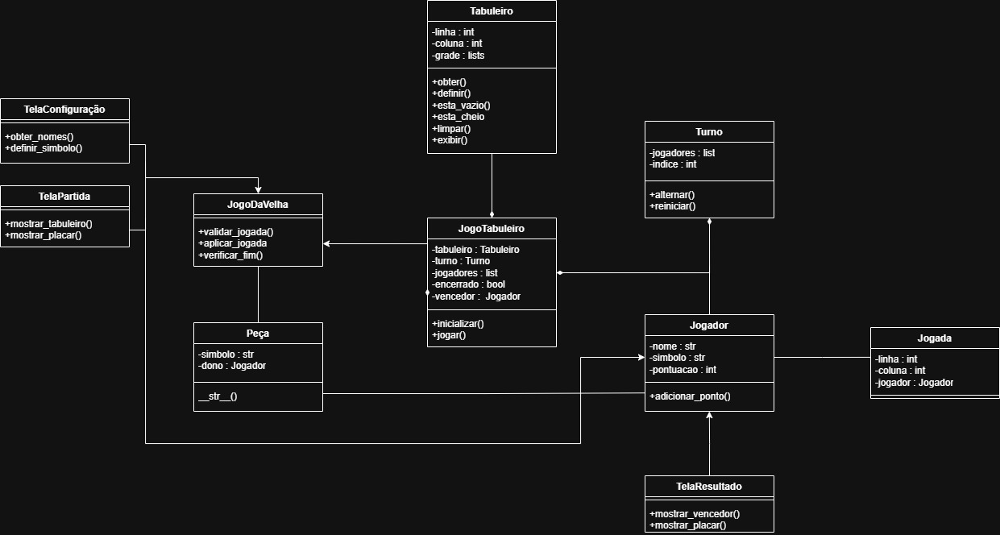

# Jogos de Tabuleiro
Projeto desenvolvido para a disciplina de Programação Orientada a Objetos.

## Jogo da Velha
A proposta é um jogo da velha com partidas melhor de cinco. Cada rodada será
decidida através de uma vitória. Em casos de empate, a rodada é redefinida até que
ocorra uma vitória. Ao término da MD5, a partida se encerra exibindo o
resultado final e o vencedor da partida.

## Integrantes
Nome: Vinicius Lavraldo de Brito                                   
RA: 2840482421023

## Instalação e execução
### Clone o repositório
      git clone https://github.com/viniciusbr1to/poo-board-game-python
      cd poo-board-game-python
### Instale as dependências
      pip install kivymd
### Execução
      python main.py
### Como jogar
      1. Na tela **MENU**, clique em **NEW MATCH**.
      2. Na tela **MATCH SETTINGS**, digite o nome de dois jogadores e escolha seus simbolos.
      3. Clique em **PLAY** para iniciar.
      4. Clique nas células do tabuleiro para fazer sua jogada.
      5. Ao fim de cada rodada, escolha **NEXT ROUND** para continuar ou **LEAVE** para voltar ao **MENU**.

## Estrutura do projeto
poo-board-game-python/
├── main.py
├── app/
│   ├── controller/
│   │   └── game_controller.py
│   ├── models/
│   │   ├── jogador.py
│   │   ├── jogada.py
│   │   ├── jogo.py
│   │   ├── peca.py
│   │   ├── tabuleiro.py
│   │   └── game/
│   │       └── jogo_da_velha.py
│   └── view/
│       ├── menu_screen.py
│       ├── config_screen.py
│       ├── board_screen.py
|       ├── result_screen.py
│       └── theme_button.py
|
|── tests/
|     ├── teste_velha.py
|
└── README.md

## UML

  

## Telas Principais

